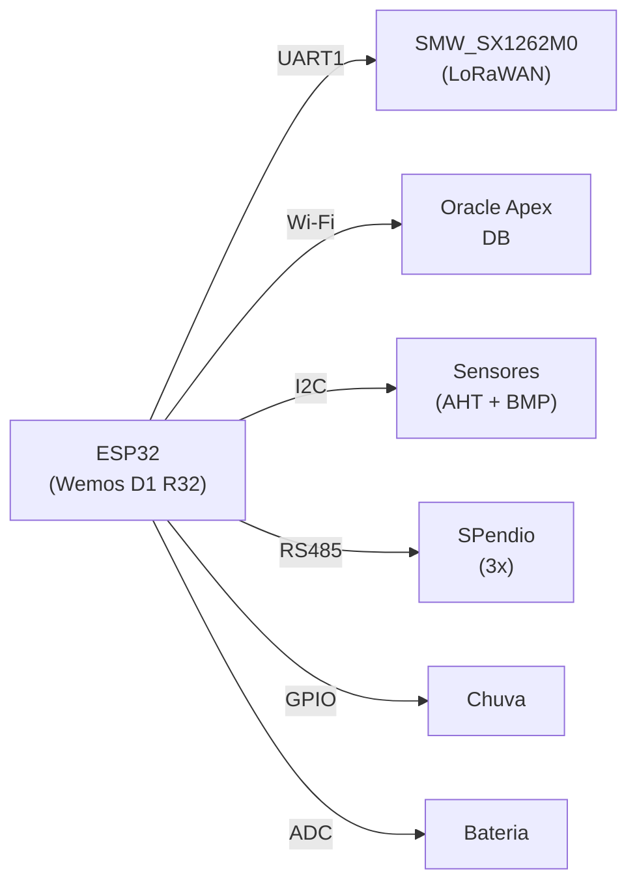

# 📡 Pendio - Monitoramento de Taludes (LoRaWAN + Wi-Fi)

Firmware integrado para o sistema de monitoramento de taludes e encostas "Pendio", baseado no ESP32 (Wemos D1 R32) com suporte para comunicação via LoRaWAN (Robocore SMW_SX1262M0) e Wi-Fi + Oracle Apex Database.

---

## 📝 Sobre o Projeto

O sistema realiza leitura integrada de múltiplos sensores e telemetria em tempo real, com capacidade de alternar entre dois modos de comunicação:

- **Modo LoRaWAN** (Padrão - Produção Campo): Comunicação de longa distância com baixo consumo
- **Modo Wi-Fi + Oracle Apex** (Produção/Desenvolvimento): Comunicação local em tempo real com armazenamento em nuvem

| Aspecto | Detalhes |
|---------|----------|
| **Versão do SW** | WRCPendio Wemos Robocore CPendio (10/01/2026) |
| **Autores** | Eng. Nuncio Perrella MSc, Eng. Arnaldo, Eng. André Maiolini |
| **Arquitetura** | Handlers abstratos (interface polimórfica) |
| **Framework** | Arduino/PlatformIO |
| **Alvo** | ESP32 DOIT DevKit V1 |

---

## ⚡ Hardware Principal

- **MCU**: Wemos D1 R32 (ESP32 / DOIT DevKit V1)
- **Comunicação**:
    - LoRaWAN: Módulo Robocore SMW_SX1262M0 (UART)
    - Wi-Fi: Built-in do ESP32
- **Sensores**:
    - **RS485**: Sensores SPendio (3 unidades: Base, Meio, Topo)
    - **I2C**: Temperatura/Umidade (AHT10/AHT20) + Pressão (BMP280)
    - **GPIO**: Sensor de Chuva (contato seco)
    - **ADC**: Monitor de tensão da bateria



**Mapeamento de Pinos**: Ver [docs/HARDWARE.md](docs/HARDWARE.md)

**Protocolo de Payload**: Ver [docs/PROTOCOLO.md](docs/PROTOCOLO.md)

--- 

## 📁 Estrutura do Projeto

```
PendioServidor/
├── include/
│   ├── system_definitions.h        # Configurações globais (modos, timeouts etc.)
│   ├── hardware_definitions.h      # Mapeamento e inicialização de pinos
│   ├── comm/
│   │   ├── CommunicationHandler.h  # Interface abstrata
│   │   ├── LoRaHandler.h           # Handler LoRaWAN
│   │   ├── WiFiHandler.h           # Handler Wi-Fi
│   │   └── credentials.h           # Credenciais (git ignored)
│   ├── core/
│   │   ├── state_machine.h         # Máquina de estados
│   │   ├── system_init.h           # Inicialização
│   │   └── system_utils.h          # Utilitários
│   ├── hardware/
│   │   └── Sensores.h              # Interface de sensores
│   └── utils/
│       └── Logger.h                # Sistema de logging
├── src/
│   ├── main.cpp                    # Firmware principal
│   ├── comm/
│   │   ├── LoRaHandler.cpp
│   │   └── WiFiHandler.cpp
│   ├── core/
│   │   ├── state_machine.cpp
│   │   ├── system_init.cpp
│   │   └── system_utils.cpp
│   ├── hardware/
│   │   └── Sensores.cpp
│   └── utils/
│       └── Logger.cpp
├── lib/                            # Bibliotecas externas
│   ├── Adafruit_AHTX0/
│   ├── Adafruit_BMP280_Library/
│   ├── Adafruit_BusIO/
│   ├── Adafruit_Sensor/
│   └── RoboCore_SMW_SX1262M0/      # *Biblioteca modificada*
├── docs/
│   ├── ARCHITECTURE.md             # Design da arquitetura
│   ├── COMMUNICATION_HANDLERS.md   # Guia de handlers
│   ├── CONFIG_GUIDE.md             # Configurações
│   ├── HARDWARE.md                 # Mapeamento de pinos
│   └── PROTOCOLO.md                # Formato de payload
├── platformio.ini                  # Configuração do build
└── README.md                       # Este arquivo
```

---

## 📖 Documentação Essencial

| Documento | Conteúdo |
|-----------|----------|
| [**docs/ARCHITECTURE.md**](./docs/ARCHITECTURE.md) | Diagrama da arquitetura, padrão de handlers, máquina de estados |
| [**docs/COMMUNICATION_HANDLERS.md**](./docs/COMMUNICATION_HANDLERS.md) | Interface CommunicationHandler, implementações LoRa e Wi-Fi |
| [**docs/CONFIG_GUIDE.md**](./docs/CONFIG_GUIDE.md) | Todas as configurações de `system_definitions.h` |
| [**docs/HARDWARE.md**](./docs/HARDWARE.md) | Mapeamento de pinos GPIO |
| [**docs/PROTOCOLO.md**](./docs/PROTOCOLO.md) | Formato de payload LoRaWAN |

---

## 🚀 Quick Start

### 1. Instalação

```bash
# Clone o repositório
git clone https://github.com/Nyfeu/PendioServidor.git
cd PendioServidor

# Copie as credenciais
cp include/comm/credentials.example.h include/comm/credentials.h

# Edite com suas chaves LoRaWAN ou credenciais Wi-Fi/Oracle Apex
nano include/comm/credentials.h
```

### 2. Configurar Modo de Comunicação

Em `include/system_definitions.h`:

```cpp
// Para LoRaWAN (padrão):
// #define COMMUNICATION_MODE_WIFI

// Ou para Wi-Fi + Firebase (protótipo):
#define COMMUNICATION_MODE_WIFI
```

### 3. Build e Upload

```bash
# Compilar
platformio run

# Upload do firmware
platformio run --target upload

# Monitor serial em tempo real
platformio device monitor --baud=115200
```

---

## 🎯 Modos de Operação

### Modo LoRaWAN (Padrão)

- **Uso**: Produção em campo
- **Conectividade**: Rede LoRaWAN pública
- **Alcance**: Longo Alcance
- **Consumo**: Muito baixo
- **Overhead**: Minimal (payload ~61 bytes)

**Ativar**: Comente a linha `#define COMMUNICATION_MODE_WIFI` em `system_definitions.h`

### Modo Wi-Fi + Oracle Apex

- **Uso**: Produção, desenvolvimento, testes ou prototipagem
- **Conectividade**: Wi-Fi local (2.4 GHz)
- **Alcance**: ~100-200 m (indoors)
- **Consumo**: Alto (Wi-Fi contínuo)
- **Overhead**: Médio (HTTP + JSON para Oracle Apex)
- **Armazenamento**: Oracle Apex Database com ORDS endpoint

**Ativar**: Descomente a linha `#define COMMUNICATION_MODE_WIFI` em `system_definitions.h`

---

## ⚙️ Configuração Principal

Todos os parâmetros se encontram em `include/system_definitions.h`:

```cpp
// Modo de operação
#define COMMUNICATION_MODE_WIFI              // Descomente para Wi-Fi + Oracle Apex

// Logging
#define ENABLE_LOGGING                1      // Ativo
#define LOG_LEVEL_DEFAULT             1      // 1=INFO, 0=DEBUG

// LoRaWAN (timeouts em ms)
#define LORA_FIXED_DR                 5      // Data Rate fixo (0-7)
#define LORA_ADR_ON                   1      // Adaptive Data Rate
#define JOIN_TIMEOUT_VALUE            10000  // OTAA Join timeout
#define CFM_TIMEOUT_VALUE             180000 // Confirmação timeout (3 min)
#define NEXT_MSG_TIMEOUT_VALUE        20000  // Entre mensagens (teste)

// Sensores
#define SENSOR_AHT_ENABLED            1      // Temperatura/Umidade
#define SENSOR_BMP_ENABLED            1      // Pressão
#define SENSOR_SPENDIO_ENABLED        1      // RS485 SPendio
#define SENSOR_RAIN_ENABLED           1      // Chuva
#define SENSOR_BATTERY_ENABLED        1      // Bateria
```

Para configurações detalhadas, consulte [docs/CONFIG_GUIDE.md](./docs/CONFIG_GUIDE.md)

---

## 📊 Estrutura de Dados

### Payload LoRaWAN (61 bytes)

```
01[SPendio_B:14][SPendio_M:14][SPendio_T:14][Temp:2][Umidade:2][Pressão:5][Chuva:4][Bateria:3][Final:1]
```

**Exemplo**: `011FB1FF25603A7E1F81F2276F423F1F41F8269F423F212B15BC600260B50`

Detalhes em [docs/PROTOCOLO.md](./docs/PROTOCOLO.md)

---

## 🔌 Credenciais e Segurança

### Arquivo `include/comm/credentials.h` (Git Ignored)

```cpp
// LoRaWAN
const char APPEUI[] = "APP EUI do sistema Kore";
const char APPKEY[] = "APP Key do sistema Kore";
Oracle Apex
const char WIFI_SSID[] = "NomeSuaRede";
const char WIFI_PASSWORD[] = "SuaSenha";
const char API_KEY[] = "API Key do Oracle Apex";
const char DB_URL[] = "https://oracleapex.com/ords/129169359232537162171/pendio/uplink_handler"; 
const char DEVICE_ID[] = "PENDIO_001";
```

⚠️ **Nunca** faça commit de `credentials.h`. Já está em `.gitignore`. 


---
## 🧾 Histórico de Instalações e Gravações

| Unidade | Descrição |
|---------|-----------|
| Pendio 1 | Sistema de Testes POLI Civil - Kaiene |
| Pendio 2 | Caixa de testes - Geólogos _ Igor |
| Pendio 3 | Arnaldo |
| Pendio 4 | USP |
| Pendio 5 | A ser instalado |
| Pendio 6 | A ser instalado (Teste Nuncio 14/11/2024) |
| Pendio 7 | Raia Olimpica USP |
| Pendio 8 | Raia Olimpica USP |
| Pendio 9 | Sensor 14/11/2024 |