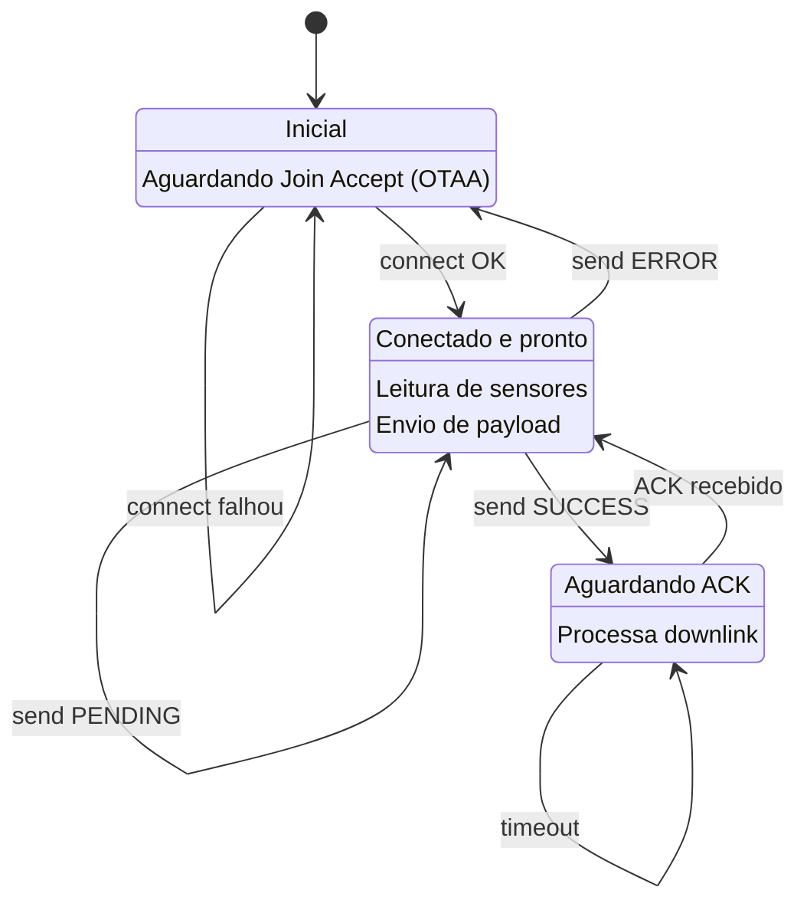

# Arquitetura do Sistema Pendio

## 🏗️ Visão Geral da Arquitetura

O sistema Pendio implementa uma **arquitetura modular e polimórfica** para suporte de comunicação (LoRaWAN + Wi-Fi) com máquina de estados centralizada.

### Aplicação Principal

| Componente | Responsabilidade | Detalhes |
|-----------|------------------|----------|
| `main.cpp` | Orquestração da aplicação | Máquina de estados, sensores, payload e downlinks |
| Máquina de Estados | Controle de fluxo | `STATE_NOT_JOINED → STATE_READY → STATE_WAIT_CFM` |
| Sensores | Aquisição de dados | SPendio (RS485), AHT, BMP, Chuva, Bateria |
| Payload | Formatação de dados | 61 bytes, formato ASCII Hex |
| Downlinks | Controle remoto | Processamento de mensagens recebidas |

---

### Interface de Comunicação

| Método | Função |
|------|--------|
| `begin()` / `end()` | Inicialização e finalização do módulo |
| `connect()` | Conexão à rede ou servidor |
| `send(port, data, len)` | Envio de telemetria |
| `isConfirmed()` | Verificação de ACK |
| `receive(msg)` | Recepção de downlink |
| `process()` | Processamento em background |
| `getConnectionState()` | Estado atual da conexão |
| `getStateString()` | Descrição legível do estado |

---

### Implementações da Interface

| Implementação | Contexto | Tecnologia | Alcance | Consumo | Status |
|--------------|---------|------------|---------|---------|--------|
| `LoRaHandler` | Produção / Campo | SX1262M0 – LoRaWAN | ~15 km | Muito baixo | Implementado 100% |
| `WiFiHandler` | Protótipo / Desktop | ESP32 Wi-Fi + Firebase RTDB | ~100–200 m | Alto | Implementado 100% |


---

## 📋 Estados da Máquina



---

## 🔀 Seleção de Handler em Tempo de Compilação

```cpp
// include/system_definitions.h

// Modo 1: LoRaWAN (PADRÃO)
// #define COMMUNICATION_MODE_WIFI

// Modo 2: Wi-Fi + Firebase
#define COMMUNICATION_MODE_WIFI

// Em main.cpp: Seleção automática
#ifdef COMMUNICATION_MODE_WIFI
    WiFiConfig wifiConfig = { /* credenciais */ };
    commHandler = new WiFiHandler(wifiConfig);
#else
    LoRaConfig loraConfig = { /* configuração */ };
    commHandler = new LoRaHandler(loraConfig);
#endif
```

---

## 📦 Estrutura de Dados Principais

### DownlinkMessage

```cpp
struct DownlinkMessage {
    uint8_t port;              // Porta (1-223)
    uint8_t data[256];         // Payload recebido
    uint16_t length;           // Tamanho dos dados
    uint32_t timestamp;        // Timestamp do recebimento
};
```

### LoRaConfig

```cpp
struct LoRaConfig {
    HardwareSerial* serial;           // Serial1 (UART para SX1262M0)
    const uint8_t* appEUI;            // Application EUI (8 bytes)
    const uint8_t* appKey;            // Application Key (16 bytes)
    bool useConfirmation;             // Usar CFM (ACK)
    bool useADR;                      // Adaptive Data Rate
    uint8_t fixedDR;                  // Data Rate (0-7) se ADR=off
    unsigned long joinTimeout;        // OTAA timeout (ms)
    unsigned long confirmTimeout;     // CFM timeout (ms)
    uint8_t maxRetries;               // Retentativas de envio
};
```

### WiFiConfig

```cpp
struct WiFiConfig {
    const char* ssid;                 // SSID da rede
    const char* password;             // Senha Wi-Fi
    const char* apiKey;               // API Key Firebase
    const char* databaseUrl;          // URL do Firebase RTDB
    const char* deviceId;             // Identificador único
    unsigned long connectTimeout;     // Timeout de conexão (ms)
};
```

---

## 🚀 Sequência de Inicialização

```
setup()
│
├─ iniHW()
│   ├─ Configurar pinos (LED, controles RS485)
│   └─ Inicializar EEPROM
│
├─ Serial.begin(115200)
│   └─ Serial de debug
│
├─ loraSerial.begin(115200)
│   └─ Serial1 (comunicação com SX1262M0)
│
├─ Inicializar sensores
│   ├─ Wire.begin() → I2C
│   ├─ AHT.begin() → Temperatura/Umidade
│   ├─ BMP.begin() → Pressão
│   ├─ Serial2.begin() → RS485 (SPendio)
│   └─ configAnalogRead() → ADC (Bateria)
│
├─ commHandler = new LoRaHandler(config) ou WiFiHandler(config)
│
├─ commHandler->begin()
│   ├─ Resetar módulo
│   ├─ Carregar configuração persistente
│   └─ Estado = DISCONNECTED
│
├─ commHandler->connect()
│   ├─ Enviar comando JOIN
│   ├─ Aguardar JOIN ACCEPT (timeout)
│   └─ Estado = CONNECTED ou ERROR
│
└─ State = STATE_NOT_JOINED ou STATE_READY

loop()
│
├─ Máquina de Estados
├─ Leitura de sensores (if timecycle timeout)
├─ Envio de dados (if payload ready)
├─ commHandler->process()
└─ Verificar estado e timeouts
```

---

## 🔌 Diagrama de Pinos (Resumido)

| Subsistema | Pino(s) | Função |
|-----------|---------|---------|
| **LoRa** | GPIO5 (RX1), GPIO23 (TX1) | UART1 → SX1262M0 |
| **I2C** | GPIO22 (SCL), GPIO21 (SDA) | Sensores AHT, BMP |
| **RS485** | GPIO16/17 (RX2/TX2), GPIO27 (nRE), GPIO19 (pDE) | SPendio |
| **Chuva** | GPIO4 | Contato seco |
| **Bateria** | GPIO39 (ADC) | Tensão (divisor) |
| **LED** | GPIO2 | LED status |

Detalhes completos: [docs/HARDWARE.md](./HARDWARE.md)

---

## 🎯 Padrão de Design: Strategy Pattern

O projeto utiliza o **Strategy Pattern** para abstrair a comunicação:

```cpp
// Abstração
CommunicationHandler* handler;

// Runtime selection (baseado em #define)
if (USE_LORA) {
    handler = new LoRaHandler(cfg);
} else {
    handler = new WiFiHandler(cfg);
}

// Código agnóstico (funciona com qualquer handler)
handler->begin();
handler->connect();
handler->send(1, payload, 61);
handler->isConfirmed();
handler->receive(msg);
```

**Benefícios**:
- ✅ Fácil alternar entre LoRa e Wi-Fi
- ✅ Código de aplicação não muda
- ✅ Fácil adicionar novos handlers (4G, MQTT, etc.)
- ✅ Testes com Mock Handler

---

## 📈 Extensibilidade: Adicionar Novo Handler

### 1. Criar Header

```cpp
// include/comm/LTE4GHandler.h
#ifndef _LTE4G_HANDLER_H
#define _LTE4G_HANDLER_H

#include "CommunicationHandler.h"

struct LTE4GConfig {
    const char* apn;
    const char* serverAddr;
    uint16_t serverPort;
    unsigned long connectTimeout;
};

class LTE4GHandler : public CommunicationHandler {
private:
    LTE4GConfig config;
    ConnectionState currentState;
    // ... membros privados
    
public:
    explicit LTE4GHandler(const LTE4GConfig& cfg);
    ~LTE4GHandler() override = default;
    
    // Implementar todos os métodos virtuais:
    bool begin() override;
    bool connect() override;
    SendResult send(uint8_t port, const uint8_t* data, uint16_t length) override;
    bool isConfirmed() override;
    ReceiveResult receive(DownlinkMessage& message) override;
    ConnectionState getConnectionState() override;
    void process() override;
    const char* getStateString() override;
    void end() override;
    bool isConnected() override;
    
    // Métodos específicos se necessário
};

#endif
```

### 2. Implementar CPP

```cpp
// src/comm/LTE4GHandler.cpp
#include "comm/LTE4GHandler.h"

LTE4GHandler::LTE4GHandler(const LTE4GConfig& cfg)
    : config(cfg), currentState(ConnectionState::DISCONNECTED) {}

bool LTE4GHandler::begin() {
    // Inicializar modem LTE/4G
    LOGI("LTE4G", "Inicializando...");
    return true;
}

// ... implementar demais métodos
```

### 3. Usar em main.cpp

```cpp
#ifdef COMMUNICATION_MODE_LTE4G
    LTE4GConfig cfg = {
        .apn = "vivo.br",
        .serverAddr = "servidor.com",
        .serverPort = 8080,
        .connectTimeout = 30000
    };
    commHandler = new LTE4GHandler(cfg);
#endif
```

---
