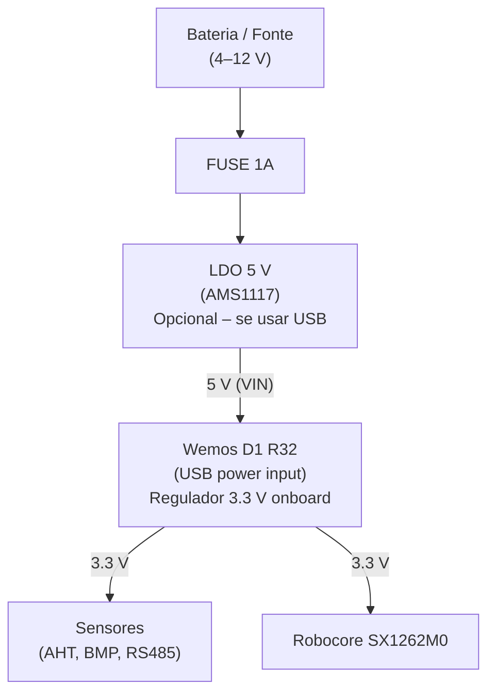

# 🔌 Documentação do Hardware - Mapeamento de Pinos

## Placa Principal: Wemos D1 R32 (ESP32)

A placa Wemos D1 R32 é uma variante do ESP32 DOIT DevKit V1 com formato compatível com Arduino.

### Características Principais

| Aspecto | Detalhes |
|---------|----------|
| **MCU** | ESP32 (Xtensa dual-core 32-bit @ 240MHz) |
| **RAM** | 520 KB SRAM |
| **Flash** | 4 MB |
| **Wi-Fi** | 802.11 b/g/n (2.4 GHz) |
| **BLE** | Sim |
| **Alimentação** | USB-C (5V) ou Bateria (3.3V) |
| **Tensão I/O** | 3.3V |
| **ADC** | 12-bit, 18 canais |
| **Pinout** | Arduino-compatible |

---

## Mapeamento de Pinos GPIO

### 📍 Tabela de Pinos Utilizados

| GPIO | Nome no Código | Periférico | Função | Pino Físico |
|:----:|---|---|---|:---:|
| **2** | `WLED` | LED | LED integrado (Wemos) | D4 |
| **4** | `nChuva` | Sensor Chuva | Entrada digital (contato seco) | D8 |
| **5** | `RXD1_LoRa` | UART1 | RX - Robocore SX1262M0 | D1 |
| **16** | `RXD2_RS485` | UART2 | RX - Sensores RS485 | RX |
| **17** | `TXD2_RS485` | UART2 | TX - Sensores RS485 | TX |
| **18** | `LLED` | LED | LED Robocore LoRaWAN | - |
| **19** | `pDE` | RS485 | Transceiver Enable TX | - |
| **21** | `pSDA_SHTU` | I2C | SDA - Sensores (AHT, BMP) | D7 |
| **22** | `pSCL_SHTU` | I2C | SCL - Sensores (AHT, BMP) | D5 |
| **23** | `TXD1_LoRa` | UART1 | TX - Robocore SX1262M0 | D23 |
| **27** | `nRE` | RS485 | Transceiver Enable RX (Ativo Baixo) | - |
| **39** | `aVBat` | ADC | Leitura analógica tensão bateria | VP |

### 📍 Pinos Especiais do ESP32

| GPIO | Função | Status |
|:----:|--------|--------|
| **0** | Boot (Pull-up) | Não usado |
| **1** | TX (Serial debug) | Serial0 (debug) |
| **3** | RX (Serial debug) | Serial0 (debug) |
| **6-11** | Flash interno | Reservado |
| **34-39** | Entrada ADC apenas | nChuva, aVBat |

---

## 🔌 Subsistemas Detalhados

### 1. LoRaWAN (UART1 - Serial1)

Comunicação com módulo Robocore SMW_SX1262M0 (radio SX1262).

```
ESP32 LoRa     ↔    Robocore SMW_SX1262M0
GPIO5 (RXD1)   ←    TX (UART)
GPIO23 (TXD1)  →    RX (UART)
GND            ←→   GND
3.3V           ←     3.3V (alimentação)
```

**Configuração em main.cpp**:
```cpp
HardwareSerial loraSerial(1);
loraSerial.begin(115200, SERIAL_8N1, 5, 23);  // RX, TX
```

**Configuração LoRaWAN**:
- Baud: 115200
- Data Bits: 8
- Stop Bits: 1
- Parity: None
- Flow Control: None

---

### 2. RS485 (UART2 - Serial2) - Sensores SPendio

Comunicação com sensores SPendio (3 endereçamentos).

```
ESP32 RS485         ↔    Transceiver RS485    ↔    Sensores SPendio
GPIO16 (RXD2)       ←    RO (Receiver Out)    ←    A/B (diferencial)
GPIO17 (TXD2)       →    DI (Driver In)       →    A/B (diferencial)
GPIO27 (nRE)        →    nRE (Rx Enable)      ⊕    GND (ativo baixo)
GPIO19 (pDE)        →    pDE (Tx Enable)      ⊕    VCC (ativo alto)
GND                 ←→   GND
3.3V                ←    VCC (alimentação)
```

**Configuração em main.cpp**:
```cpp
Serial2.begin(19200, SERIAL_8N1, 16, 17);  // RX, TX
digitalWrite(19, LOW);   // pDE = TX disabled
digitalWrite(27, HIGH);  // nRE = RX enabled (default)
```

**Configuração RS485**:
- Baud: 19200
- Data Bits: 8
- Stop Bits: 1
- Parity: None

**Controle de Direção (Half-Duplex)**:
```cpp
#define pDE 19   // Transmit Enable (ativo alto)
#define nRE 27   // Receive Enable (ativo baixo)

// Para receber
digitalWrite(pDE, LOW);   // TX disabled
digitalWrite(nRE, LOW);   // RX enabled

// Para transmitir
digitalWrite(pDE, HIGH);  // TX enabled
digitalWrite(nRE, HIGH);  // RX disabled
```

---

### 3. I2C (Wire) - Sensores Atmosféricos

Comunicação com sensores AHT (temperatura/umidade) e BMP280 (pressão).

```
ESP32 I2C          ↔    AHT10/20                BMP280
GPIO21 (SDA)       ↔    SDA                      SDA
GPIO22 (SCL)       ↔    SCL                      SCL
3.3V               ←    VCC                      VCC
GND                ←→   GND                      GND
(Pull-ups 4.7kΩ)                         (internos no módulo)
```

**Configuração em main.cpp**:
```cpp
Wire.begin(21, 22);  // SDA=21, SCL=22
Wire.setClock(100000);  // 100 kHz
```

**Endereços I2C**:
- AHT10/20: `0x38` (fixo)
- BMP280: `0x76` ou `0x77` (jumper seleccionável)

---

### 4. GPIO - Sensor de Chuva

Entrada digital simples (contato seco).

```
ESP32           ↔    Sensor Chuva (Bucket)
GPIO4           ←    Contato seco
GND             ←→   GND comum

// Tipicamente ativo baixo (HIGH quando seco, LOW quando chuva)
```

**Leitura**:
```cpp
#define nChuva 4

if (!digitalRead(nChuva)) {
    // Chovendo
} else {
    // Seco
}

// Ou macro auxiliar:
if (temChuva()) {
    Serial.println("Detectada chuva!");
}
```

---

### 5. ADC - Sensor de Bateria

Leitura analógica da tensão da bateria via divisor de tensão.

```
Bateria (V_bat)
   │
   R1 (ex: 100kΩ)
   │
GPIO39 (ADC) ←── Leitura
   │
   R2 (ex: 100kΩ)
   │
  GND
```

**Configuração ADC**:
```cpp
#define aVBat 39

void configAnalogRead() {
    analogSetWidth(12);         // 12-bit resolution (0-4095)
    analogSetAttenuation(ADC_11db);  // Até 3.3V
    // Alternativa: ADC_6db (até 2.2V), ADC_2_5db (até 1.1V)
}

// Leitura
int raw = analogRead(aVBat);
float voltage = (raw / 4095.0) * 3.3;  // Tensão no pino

// Com divisor de tensão 1:1 (R1=R2)
float battery_voltage = voltage * 2;  // Tensão real da bateria
```

**Exemplo de Conversão**:
```cpp
// Para divisor 1:1 (R1=R2=100k)
float get_battery_voltage() {
    int raw = analogRead(aVBat);
    float v_pin = (raw / 4095.0) * 3.3;
    return v_pin * 2.0;  // Fator de divisão
}
```

---

### 6. LEDs de Status

#### LED Wemos (GPIO2 - D4)

```
ESP32           ↔    LED Wemos
GPIO2           ←    Ânodo (através de resistência)
GND             ←    Cátodo
```

```cpp
#define WLED 2

ligWLED();      // Liga
desWLED();      // Desliga
invWLED();      // Inverte
```

#### LED Robocore (GPIO18 - LLED)

```
ESP32           ↔    LED Robocore
GPIO18          ←    Ânodo
GND             ←    Cátodo
```

```cpp
#define LLED 18

ligLLED();      // Liga
desLLED();      // Desliga
invLLED();      // Inverte
```

---

## ⚡ Alimentação

### Tensões de Operação

| Sistema | Tensão | Corrente | Notas |
|---------|--------|----------|-------|
| ESP32 | 3.3V | 80-200 mA | Regulador LDO onboard |
| LoRa SX1262 | 3.3V | 10-150 mA | Pulsado |
| AHT10/20 | 3.3V | ~1 mA | Contínuo |
| BMP280 | 3.3V | ~1 mA | Contínuo |
| RS485 | 3.3V | ~10 mA | Depende dos sensores |

**Consumo Total**:
- **Idle**: ~10 mA
- **LoRa TX**: ~200 mA
- **Wi-Fi TX**: ~300-400 mA

### Fonte de Alimentação



---

## 🔧 Inicialização de Hardware

Em `src/hardware_definitions.cpp`:

```cpp
void iniHW(void) {
    // Configurar pinos como output/input
    pinMode(WLED, OUTPUT);
    pinMode(LLED, OUTPUT);
    pinMode(nChuva, INPUT_PULLUP);
    pinMode(pDE, OUTPUT);
    pinMode(nRE, OUTPUT);
    
    // Estado inicial
    desWLED();
    desLLED();
    digitalWrite(pDE, LOW);   // RS485 RX mode
    digitalWrite(nRE, LOW);
    
    // Inicializar EEPROM
    EEPROM.begin(512);
}

void iniHWPorts(void) {
    // Serial Debug
    Serial.begin(115200);
    
    // Serial1 (LoRa)
    loraSerial.begin(115200, SERIAL_8N1, RXD1_LoRa, TXD1_LoRa);
    
    // Serial2 (RS485)
    Serial2.begin(19200, SERIAL_8N1, RXD2_RS485, TXD2_RS485);
    
    // I2C (Sensores)
    Wire.begin(pSDA_SHTU, pSCL_SHTU);
    Wire.setClock(100000);
}
```

---

## 🔗 Referências

- [ARCHITECTURE.md](./ARCHITECTURE.md) - Diagrama geral
- [CONFIG_GUIDE.md](./CONFIG_GUIDE.md) - Configurações
- [PROTOCOLO.md](./PROTOCOLO.md) - Payload
- [RoboCore SMW_SX1262M0](https://github.com/RoboCore/RoboCore_SMW-SX1262M0) - Documentação do módulo LoRa

---
